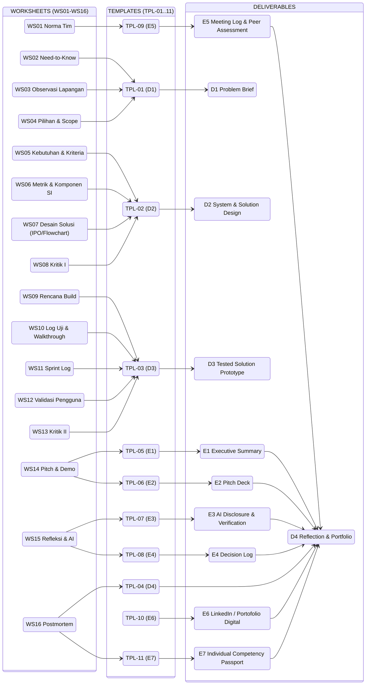

Tags: #type/guidebook #domain/pbl #pbl/level-1
# Buku Petunjuk Project-Based Learning (PjBL) — Level 1 (Revisi 3)
Version : Draft v3.0 | Last Updated : 2026-09-19
Related Files:
- `project_guide_level_1`
- `learning_spine`
- [WORKSHEET_BOOK.md](WORKSHEET_BOOK.md)
- [TEMPLATE_PACK.md](TEMPLATE_PACK.md)
- [ASSESSMENT_RUBRICS.md](ASSESSMENT_RUBRICS.md)
- `individual_competency_passport`
- [JADWAL_SEMESTER.md](JADWAL_SEMESTER.md)

**Digital Problem Framing Mini Project** | Program Studi Sistem Informasi | Semester 1 (Foundation Entry) | TA 2026/2027

> **Apa yang berubah di revisi ini (mengacu `revision_note_1.md`)?**
> 1. **Learning spine 8 fase**: Discover → Frame → Define → Design → **GATE 1** → Build → Test → **GATE 2** → Communicate → Reflect → **DEMO DAY**.
> 2. **4 core artifacts (D1–D4)** menggantikan D1–D7 lama. AI disclosure, decision log, meeting log, peer assessment, LinkedIn menjadi **supporting evidence** (lampiran D4), bukan deliverable terpisah.
> 3. **Rotating phase lead** menggantikan peran tetap (Koordinator/Analis/Pengembang/Dokumentator).
> 4. **Asesmen individu 50/30/20** + **Individual Competency Passport**.

---

## Daftar Isi
1. [Pendahuluan](#bagian-1-pendahuluan)
2. [Learning Spine & Lini Masa](#bagian-2-learning-spine--lini-masa)
3. [Rotating Phase Lead](#bagian-3-rotating-phase-lead)
4. [Deliverables D1–D4 & Supporting Evidence](#bagian-4-deliverables)
5. [Asesmen, Rubrik & Passport](#bagian-5-asesmen)
6. [Worksheet, AI Policy & Tips Sukses](#bagian-6-worksheet-ai-policy--tips-sukses)

---

# Bagian 1: Pendahuluan

## 1.1 Latar Belakang
Proyek **Digital Problem Framing Mini Project** memberi pengalaman nyata mengenali dan merumuskan masalah organisasi kecil, lalu membangun prototipe penyelesaian sederhana. Penting karena:
- **Analisis masalah** adalah fondasi profesi sistem informasi — masalah sebelum solusi.
- **Pengalaman autentik** di unit usaha nyata membangun berpikir kritis & kemandirian.
- **Integrasi lintas MK**: Konsep Sistem Informasi, Dasar Pemrograman, Komunikasi Profesional & Kerja Tim, Bahasa Inggris dalam satu proyek.
- **Kesiapan kerja**: dokumentasi, komunikasi, kepemimpinan fase, etika.

## 1.2 Kompetensi Target (SFIA)
| Kemampuan | Level | Bukti Utama |
|---|---|---|
| Business Situation Analysis (BUSA) | L1 | D1, D2, Gate 1 |
| Information Management (IRMG) | L1 | Data & bukti D1 |
| Programming/Software Development (PROG) | L1 | D3, Gate 2 |
| Content Publishing (ICPM) | L2 | D4, executive summary |
| Customer Service Support (CSMG) | L2 | D4, komunikasi tim |

## 1.3 Deskripsi Proyek
Mahasiswa memilih **satu unit usaha kecil nyata** (kantin kampus, warung, koperasi, unit layanan kampus) sebagai objek studi, lalu:
1. Merumuskan masalah menjadi kebutuhan awal terukur (D1–D2).
2. Merancang alur/skema solusi sederhana (D2).
3. Membangun & menguji prototipe program konsol (D3).
4. Menyusun refleksi & portofolio, mempresentasikan hasil (D4 + Demo Day).

**Driving Question**: "Bagaimana kita memahami masalah nyata sebuah unit usaha kecil di sekitar kampus, merumuskannya menjadi kebutuhan awal yang terukur, dan membangun prototipe sederhana yang benar-benar membantu mereka?"

**Batasan teknis**: tanpa database; tanpa integrasi sistem lain; tanpa web/mobile; prototipe program konsol (CLI/Python); wajib observasi & wawancara lapangan sebagai bukti.

---

# Bagian 2: Learning Spine & Lini Masa

## 2.1 Learning Spine (8 Fase)
```
DISCOVER → FRAME → DEFINE → DESIGN → [GATE 1] → BUILD → TEST → [GATE 2] → COMMUNICATE → REFLECT → [DEMO DAY]
```

| Fase | Minggu | Fokus | Worksheet |
|---|---|---|---|
| Discover | 1 | Entry event, tim, norma, need-to-know | WS01, WS02 |
| Frame | 2 | Observasi lapangan, scope masalah | WS03, WS04 |
| Define | 3–4 | Kebutuhan, kriteria penerimaan, metrik | WS05, WS06 |
| Design | 5–7 | Desain solusi + kritik I | WS07, WS08 |
| **GATE 1** | **8** | **D1+D2 sign-off + oral defense individu** | — |
| Build | 9–12 | Pengkodean prototipe | WS09, WS10, WS11 |
| Test | 11–12 | Validasi pengguna + kritik II | WS12, WS13 |
| **GATE 2** | **13** | **D3 final + code walkthrough individu** | — |
| Communicate | 14–15 | Executive summary, pitch, rehearsal | WS14 |
| Reflect | 13–16 | Refleksi, AI disclosure, portfolio | WS15, WS16 |
| **DEMO DAY** | **16** | **Presentasi publik; D4 final; passport** | — |

## 2.2 Titik Checkpoint Besar
| Checkpoint | Kapan | Persyaratan |
|---|---|---|
| **GATE 1** | M8 | D1 + D2 final (TPL-01, TPL-02); **oral defense** per individu |
| **GATE 2** | M13 | D3 final + bukti testing (TPL-03); **code walkthrough** per individu; draf D4 |
| **DEMO DAY** | M16 | D4 final + supporting evidence + passport; presentasi publik |

---

# Bagian 3: Rotating Phase Lead

Tim **tidak memakai peran permanen**. Setiap anggota menjadi **phase lead** secara bergilir — setiap anggota memimpin minimal satu fase.

| Fase | Phase Lead |
|---|---|
| Discover → Build | Anggota A |
| Frame → Test | Anggota B |
| Define → Communicate | Anggota C |
| Design → Reflect | Anggota D |

Aturan:
- Phase lead **menjadwalkan rapat fase, membagi tugas, memantau progres**, dan melapor ke dosen.
- Keputusan penting fase dicatat di **Decision Log** (lampiran D4).
- Tim 3 orang: dua fase terakhir dikelola bersama; semua tetap memimpin minimal satu fase.

---

# Bagian 4: Deliverables

## 4.1 Core Learning Artifacts (D1–D4)
| Kode | Deliverable | Isi Utama | MK Owner | Deadline |
|---|---|---|---|---|
| **D1** | Problem Brief | User/context, bukti, insight, problem statement, impact, scope & non-scope, success metric | Konsep SI | Draf M2 → GATE 1 |
| **D2** | System & Solution Design | User story, requirements, acceptance criteria, IPO, data, flowchart, pseudocode, solution concept, validasi | Konsep SI (+ Dasar Prog) | Draf M4 → GATE 1 |
| **D3** | Tested Solution Prototype | Prototipe konsol + kode, test cases & results, user validation, improvement, limitation | Dasar Prog | Design GATE 1 → GATE 2 |
| **D4** | Reflection & Portfolio | Summary, decisions, kontribusi individu, AI disclosure, verification, refleksi, dokumentasi portfolio | Kom. Profesional & B. Inggris (co-owner) | Draf GATE 2 → DEMO DAY |

Format penyerahan: **TPL-01** (D1), **TPL-02** (D2), **TPL-03** (D3), **TPL-04** (D4) — lihat [template_pack](TEMPLATE_PACK.md).

## 4.2 Supporting Evidence (lampiran, dibukukan di D4)
| Evidence | Isi | Template |
|---|---|---|
| Executive Summary & Pitch Deck | Ringkasan eksekutif (EN, 150–250 kata) + pitch maks. 8 slide | TPL-05, TPL-06 |
| AI Usage Disclosure & Verification Note | Tool AI, bagian dibantu, modifikasi, verifikasi manual | TPL-07 |
| Decision Log | Keputusan penting + alternatif + alasan (min. 5 entri) | TPL-08 |
| Meeting Log & Peer Assessment | Log pertemuan, kontribusi, umpan balik, refleksi etika | TPL-09 |
| Profil LinkedIn / Portofolio Digital | Foto, headline, about, projects, skills | TPL-10 |
| Individual Competency Passport | Skor & status klaim 9 kompetensi | TPL-11 |

## 4.3 Peta Koneksi: Worksheet → Template → Deliverable



Terbaca: setiap **worksheet** menopang **template** tertentu; template inti (TPL-01..04) membentuk **deliverable D1–D4**, sedangkan template lampiran (TPL-05..11) menjadi **supporting evidence E1–E7** yang dibukukan ke dalam **D4**.

---

# Bagian 5: Asesmen

## 5.1 Skema (default 50/30/20)
| Komponen | Bobot | Bukti |
|---|---|---|
| **Team Evidence** — D1–D4 + kualitas produk | 50% | Rubrik core artifact |
| **Individual Evidence** — Gate 1 oral defense, Gate 2 code walkthrough | 30% | Rubrik per individu |
| **Individual Reflection/Process** — refleksi, kontribusi, decision explanation, journal | 20% | Rubrik Sub-CPMK, passport |

## 5.2 Indikator Penilaian Individu
- GATE 1: kamu harus mampu **menjelaskan masalah & bukti, dan logika desain** secara mandiri.
- GATE 2: kamu harus mampu **menjelaskan kode baris demi baris** dan **membuktikan hasil uji**.
- AI bagian mana pun harus bisa kamu jelaskan dan verifikasi secara manual.

## 5.3 Individual Competency Passport
9 kompetensi: **problem framing, system thinking, computational thinking, programming, testing, communication, collaboration, AI literacy, reflection**. Isi format di `individual_competency_passport`.

---

# Bagian 6: Worksheet, AI Policy & Tips Sukses

## 6.1 Worksheet (16)
WS01 Normalisasi tim · WS02 Need-to-Know · WS03 Observasi lapangan · WS04 Scope · WS05 Kebutuhan · WS06 Metrik · WS07 Desain · WS08 Kritik I · WS09 Rencana build · WS10 Log uji & walkthrough · WS11 Sprint log · WS12 Validasi pengguna · WS13 Kritik II · WS14 Pitch/demo · WS15 Refleksi & AI · WS16 Postmortem. Panduan: [worksheet_book](WORKSHEET_BOOK.md).

## 6.2 AI Policy (ringkas)
1. AI = co-pilot, bukan substitusi.
2. Wajib **AI disclosure & verification note** pada setiap artefak (lampiran D4).
3. Dilarang menyerahkan output AI mentah tanpa analisis, modifikasi, dan verifikasi manual.
4. Entry event, sesi critique, dan refleksi **tidak boleh dilakukan oleh AI**.
Detail: `ai_policy`.

## 6.3 Tips Sukses
- **Malcolm Lihat bukti pertama**: data lapangan adalah jangkar D1–D2.
- **Jaga scope**: batasi fitur; perubahan besar hanya lewat decision log.
- **Catat kontribusi**: log kontribusi & peer assessment penting untuk nilai individu.
- **Berani menerima kritik**: protokol *be kind, be specific, be helpful*.
- **Siapkan diri untuk gate**: latih oral defense & walkthrough sebelum GATE 1 & 2.

---

*Buku petunjuk ini diselaraskan dengan `revision_note_1.md`, project guide, learning spine, worksheet book, dan assessment rubrics level 1.*
